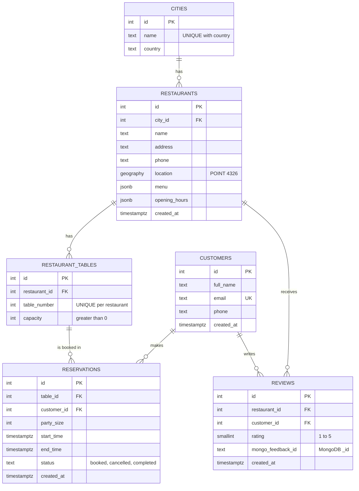

# ER Diagram

PostgreSQL schema (3NF). Long-form review text is stored in MongoDB
(`feedback` collection) and linked through `reviews.mongo_feedback_id`.

```mermaid
erDiagram
    CITIES            ||--o{ RESTAURANTS       : "has"
    RESTAURANTS       ||--o{ RESTAURANT_TABLES : "has"
    RESTAURANT_TABLES ||--o{ RESERVATIONS      : "is booked in"
    CUSTOMERS         ||--o{ RESERVATIONS      : "makes"
    RESTAURANTS       ||--o{ REVIEWS           : "receives"
    CUSTOMERS         ||--o{ REVIEWS           : "writes"

    CITIES {
        int  id PK
        text name "UNIQUE with country"
        text country
    }

    CUSTOMERS {
        int         id PK
        text        full_name
        text        email UK
        text        phone
        timestamptz created_at
    }

    RESTAURANTS {
        int         id PK
        int         city_id FK
        text        name
        text        address
        text        phone
        geography   location "POINT 4326"
        jsonb       menu
        jsonb       opening_hours
        timestamptz created_at
    }

    RESTAURANT_TABLES {
        int id PK
        int restaurant_id FK
        int table_number "UNIQUE per restaurant"
        int capacity "greater than 0"
    }

    RESERVATIONS {
        int         id PK
        int         table_id FK
        int         customer_id FK
        int         party_size
        timestamptz start_time
        timestamptz end_time
        text        status "booked, cancelled, completed"
        timestamptz created_at
    }

    REVIEWS {
        int         id PK
        int         restaurant_id FK
        int         customer_id FK
        smallint    rating "1 to 5"
        text        mongo_feedback_id "MongoDB _id"
        timestamptz created_at
    }
```
